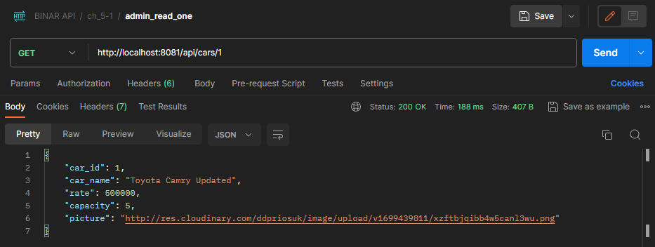
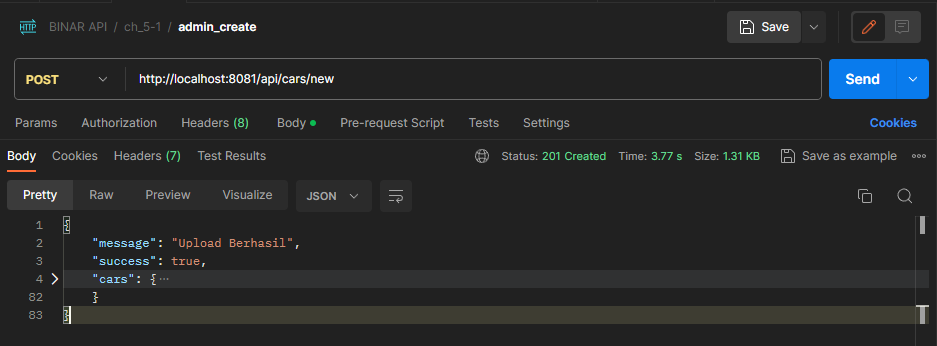
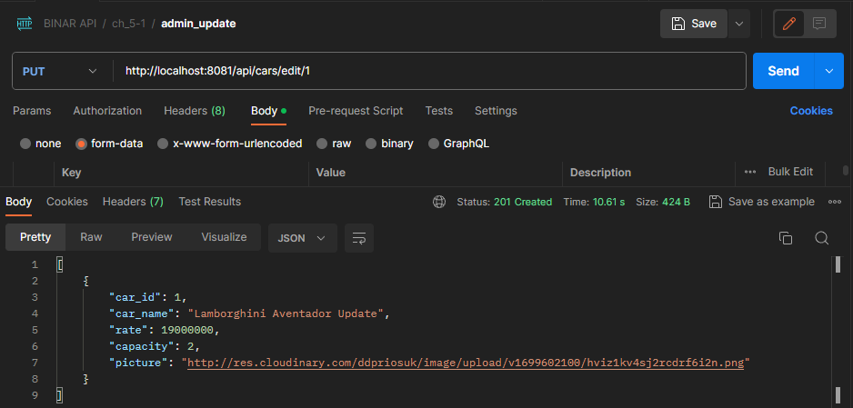

<<<<<<< HEAD
# BINAR Car Rental RESTAPI Docs

This is the REST API for BINAR Car Rental, the technology used for this API is Node js for runtime environment, knex js for database connection and ORM and express js for backend HTTP server. 


Welcome to the repository for the SYNRGY Landing Page Challenge 5. This project is part of the SYNRGY coding challenges, and it focuses on creating an engaging and visually appealing landing page.

## Table of Contents
- [Overview](#overview)
- [Features](#features)
- [Installation](#installation)
- [Setup](#setup)
- [Usage](#usage)

## Overview

The SYNRGY Landing Page Challenge 5 is designed to test and enhance your skills in web development. The goal is to create a captivating landing page that effectively communicates a message or showcases a product. This repository provides a starting point with the basic structure and files needed for the challenge.

## Features

- **Create Operation**

- **Read Operation**

- **Update Operation**

- **Delete Operation**

## Installation

To get started with the SYNRGY Landing Page Challenge 5, follow these steps:

1. Clone the repository to your local machine:

    ```bash
        git clone https://github.com/Mwazowsky/SYNRGY-Landing-Page.git
    
    ```
   

## Setup

### Setting up the server

In the root directory of the project...

1. Install node modules `yarn install` or `npm install`.
2. Start development server `yarn start` or `npm start`.

### Setting up the Database Connection

This project is using postgresql as its database, make sure you already have postgres database instance running and accesible. And modify the knexfile.js with your database details.

    ```javascript
    module.exports = {
        development: {
            client: 'postgresql',
            connection: {
                host: '<YOUR DB HOST>',
                database: '<YOUR DB_NAME>',
                user: '<YOUR PG USERNAME>',
                password: '<YOUR PG PASSWORD>'
            },
            pool: {
                min: 2,
                max: 10
            },
            migrations: {
                tableName: 'knex_migrations',
                directory: `${__dirname}/db/migrations`
            },
            seeds: {
                directory: `${__dirname}/db/seeds`
            }
        }
    };    
    ```

Next you need to populate your database with tables and data to store the data. the details of the database Entity Relationship Diagram is as follows:


to populate your database with the required fields and tables run this command in your terminal

    ```bash
       npx knex migrate:latest --env development
    ```

and to seed the database with initial data run this following command

    ```bash
        npx knex seed:run
    ```

### Setting Up Cloudinary cloud storage

Before you can use the API we need to setup cloud storage for storing our media files upload such as image modify ./services/storage.js to use your own cloudinary storage connection details

    ```javascript
    const cloudinary = require('cloudinary').v2;

    cloudinary.config({
      cloud_name: '<YOUR_CLOUD_NAME>',
      api_key: '<YOUR_CLOUDINARY_API_KEY>',
      api_secret: '<YOUR_CLOUDINARY_API_SECRET>',
    });

    module.exports = cloudinary;
    ```

## Usage
=======
[# BINAR Car Rental RESTAPI Docs

These examples were taken from projects mainly using [Django Rest
Framework](https://github.com/tomchristie/django-rest-framework) and so the
JSON responses are often similar to the way in which DRF makes responses.

Where full URLs are provided in responses they will be rendered as if service
is running on 'http://testserver/'.

## Open Endpoints

Open endpoints require no Authentication.

* [Login](login.md) : `POST /api/login/`

## Endpoints that require Authentication

Closed endpoints require a valid Token to be included in the header of the
request. A Token can be acquired from the Login view above.

### Current User related

Each endpoint manipulates or displays information related to the User whose
Token is provided with the request:

* [Show info](user/get.md) : `GET /api/user/`
* [Update info](user/put.md) : `PUT /api/user/`

### Account related

Endpoints for viewing and manipulating the Accounts that the Authenticated User
has permissions to access.

* [Show Accessible Accounts](accounts/get.md) : `GET /api/accounts/`
* [Create Account](accounts/post.md) : `POST /api/accounts/`
* [Show An Account](accounts/pk/get.md) : `GET /api/accounts/:pk/`
* [Update An Account](accounts/pk/put.md) : `PUT /api/accounts/:pk/`
* [Delete An Account](accounts/pk/delete.md) : `DELETE /api/accounts/:pk/`
](url)

## API Endpoints
>>>>>>> 6290f0a5a10b0121f3679d64a96789ca97c1d62a

### Cars

- **GET /api/cars**
<<<<<<< HEAD
  - Description: Get list of all cars.
=======
  - Description: Get a list of cars.
>>>>>>> 6290f0a5a10b0121f3679d64a96789ca97c1d62a
  - Example Request: `GET http://localhost:8000/api/cars`
  - Example Response:
    ```json
    {
<<<<<<< HEAD
    "cars": [
            {
                "car_id": 3,
                "car_name": "Avanza",
                "rate": 100000,
                "capacity": 4,
                "picture": "http://res.cloudinary.com/ddpriosuk/image/upload/v1699422158/djzviwbynjgwd8kxipkf.png"
            },
            {
                "car_id": 4,
                "car_name": "Pajero Edited twice",
                "rate": 19000000,
                "capacity": 20,
                "picture": "http://res.cloudinary.com/ddpriosuk/image/upload/v1699431383/mwm9sdpw9xltxjjsutof.png"
            }
        ]
    }
    ```
    
    

- **GET /api/cars/:carId**
  - Description: Get one cars.
  - Example Request: `GET http://localhost:8000/api/cars/:id`
  - Example Response:
    ```json
        {
            "car_id": 1,
            "car_name": "Toyota Camry Updated",
            "rate": 500000,
            "capacity": 5,
            "picture": "http://res.cloudinary.com/ddpriosuk/image/upload/v1699439811/xzftbjqibb4w5canl3wu.png"
        }
    ```

    

- **POST /api/cars/new**
  - Description: Create a new car.
  - Example Request: `POST http://localhost:8000/api/cars/new`
    - Request Form

    

  - Example Response:
    ```json
    {
        "message": "Upload Berhasil",
        "success": true,
        "cars": {
         ...
        }
    }
    ```

    

- **PUT /api/cars/edit/:carId**
  - Description: Update a car.
  - Example Request: `PUT http://localhost:8000/cars/edit/1`
    - Request Form:
    
    
      
  - Example Response:
    ```json
    [
        {
            "car_id": 1,
            "car_name": "Lamborghini Aventador Update",
            "rate": 19000000,
            "capacity": 2,
            "picture": "http://res.cloudinary.com/ddpriosuk/image/upload/v1699602100/hviz1kv4sj2rcdrf6i2n.png"
        }
    ]
    ```

    

- **DELETE /api/users/:carId**
  - Description: Delete a car.
  - Example Request: `DELETE http://localhost:8000/api/cars/delete/1`
=======
      "type": "success",
      "message": "Berhasil mengambil data dari database!",
      "data": [
        {
          "car_id": 1,
          "name": "honda",
          "price": 5500,
          "picture": "img",
          "start_rent": "2023-11-08T07:07:32.214Z",
          "finish_rent": "2023-10-08T12:00:00.000Z",
          "created_at": "2023-11-08T07:07:32.214Z",
          "updated_at": "2023-11-08T07:07:32.214Z"
        },
        {
          "car_id": 2,
          "name": "suzuki",
          "price": 4500,
          "picture": "http://res.cloudinary.com/dqhdxgqyc/image/upload/v1699506566/tz44yqqyyswasyhecrqy.jpg",
          "start_rent": "2023-11-09T05:09:27.700Z",
          "finish_rent": null,
          "created_at": "2023-11-09T05:09:27.700Z",
          "updated_at": "2023-11-09T05:09:27.700Z"
        }]
    }
    ```

- **POST /api/users**
  - Description: Create a new car.
  - Example Request: `POST http://localhost:8000/api/cars`
    - Request Body:
      ```json
      {
        "name" : "honda",
        "price" : 2500,                
        "picture" : "https://res.cloudinary.com/dqhdxgqyc/image/upload/v1699507003/rzrg3r7qkn1xh2jwflk5.jpg",
        "start_rent" : "CURRENT_TIMESTAMP",
        "finish_rent" : "CURRENT_TIMESTAMP"
      }
      ```
  - Example Response:
    ```json
    { 
      "type": "success",
      "message": "Upload gambar dan data berhasil!",
      "data": [
        "name" : "honda",
        "price" : 2500,                
        "picture" : "https://res.cloudinary.com/dqhdxgqyc/image/upload/v1699507003/rzrg3r7qkn1xh2jwflk5.jpg",
        "start_rent" : "CURRENT_TIMESTAMP",
        "finish_rent" : "CURRENT_TIMESTAMP"
      ],
    }
    ```

- **PUT /api/users/:carId**
  - Description: Update a car.
  - Example Request: `PUT http://localhost:8000/api/cars/1`
    - Request Body:
      ```json
      {
        "name" : "honda",
        "price" : 2500,                
        "picture" : "https://res.cloudinary.com/dqhdxgqyc/image/upload/v1699507003/rzrg3r7qkn1xh2jwflk5.jpg",
        "start_rent" : "CURRENT_TIMESTAMP",
        "finish_rent" : "CURRENT_TIMESTAMP"
      }
      ```
  - Example Response:
    ```json
    { 
      "type" : "success",
      "message" : "Data berhasil diperbarui!",
      "data" : [
        "name" : "honda",
        "price" : 2500,                
        "picture" : "https://res.cloudinary.com/dqhdxgqyc/image/upload/v1699507003/rzrg3r7qkn1xh2jwflk5.jpg",
        "start_rent" : "CURRENT_TIMESTAMP",
        "finish_rent" : "CURRENT_TIMESTAMP"
      ],
    }
    ```

- **DELETE /api/users/:carId**
  - Description: Delete a car.
  - Example Request: `DELETE http://localhost:8000/api/cars/1`
>>>>>>> 6290f0a5a10b0121f3679d64a96789ca97c1d62a
    
  - Example Response:
    ```json
    { 
      "type" : "success",
      "message" : "Data berhasil dihapus!",
<<<<<<< HEAD
      "id" : 1
    }
    ```

    

=======
      "id" : carId
    }
    ```

>>>>>>> 6290f0a5a10b0121f3679d64a96789ca97c1d62a
